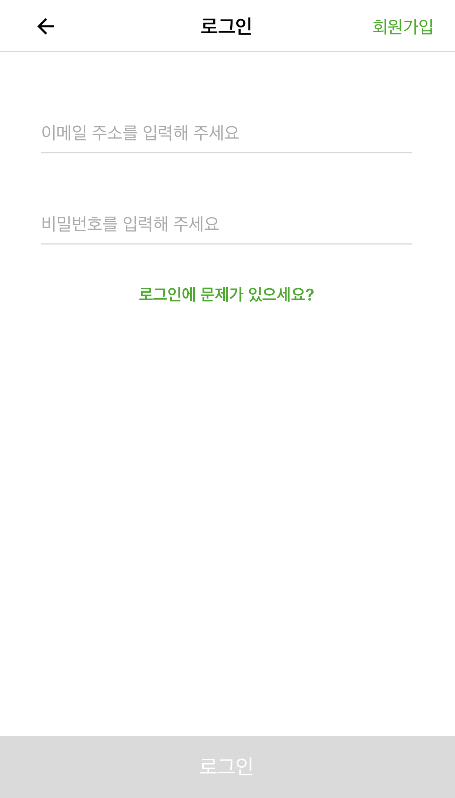
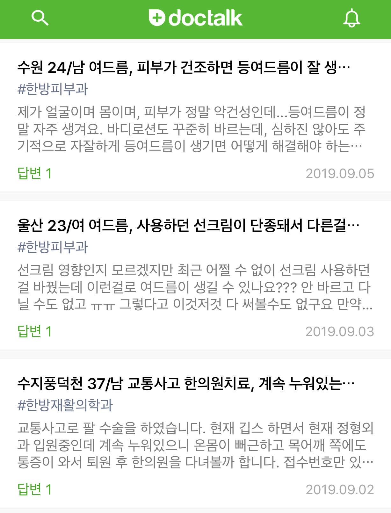
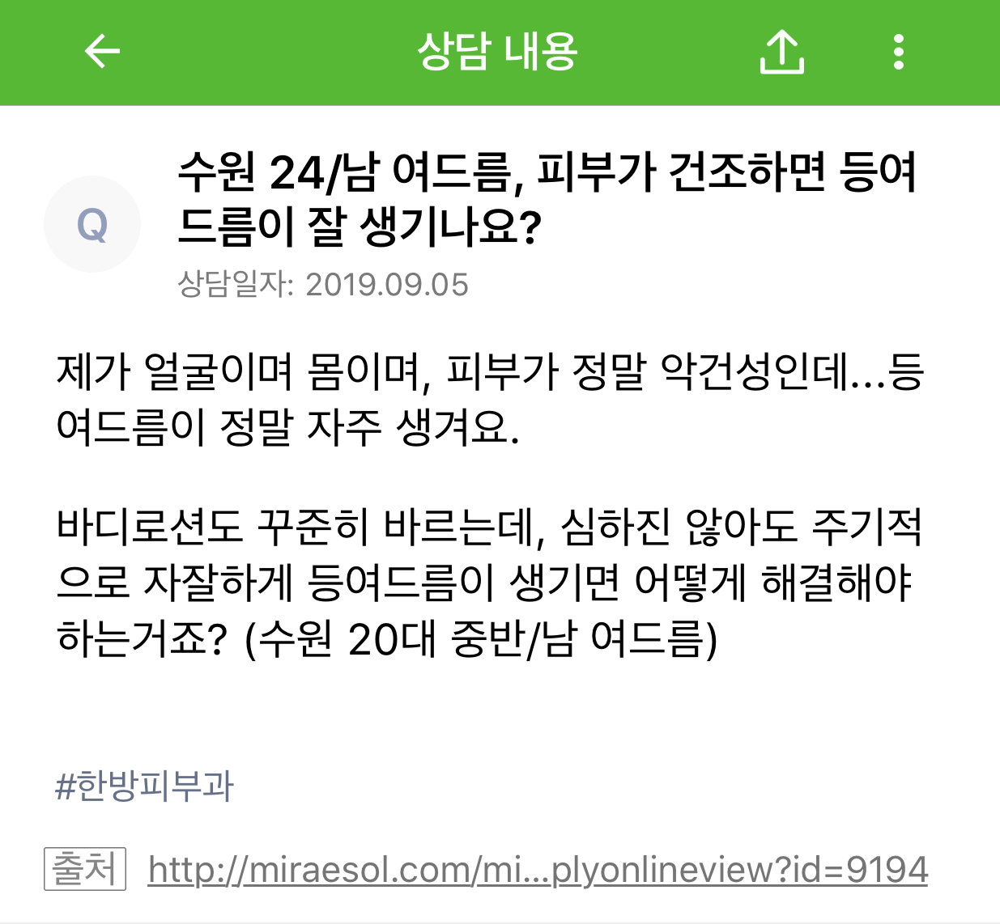
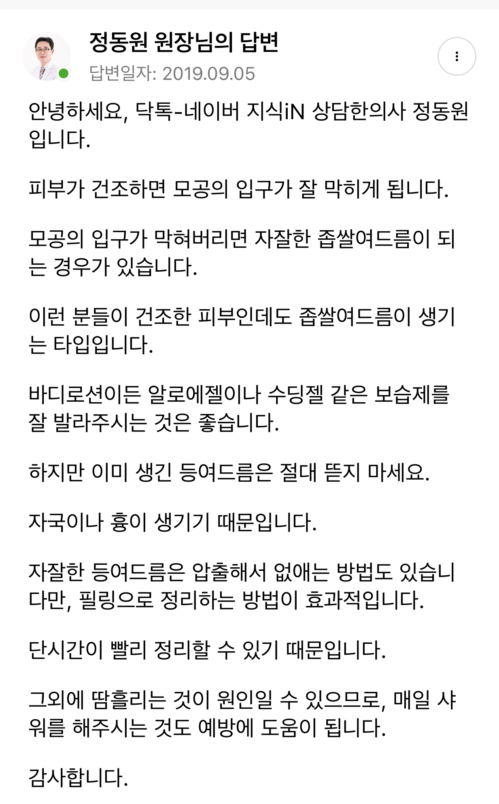

# Docfriends_Server_Recruit

안녕하세요

닥프렌즈 서버 개발자 채용에 지원해주셔서 감사합니다.

깃헙 [repository](https://github.com/Docfriends/Docfriends_Server_Recruit)를 fork하신 뒤, 작업하여 폴더에 solution을 넣어 push 해주시면 됩니다.

이 프로젝트의 목적은 Doctalk 웹의 데이터를 반환하는 RESTFul API를 만들고 Front js를 활용해서 UI를 만드는 것 입니다.

전달되는 앱의 형태를 확인하여 DB 구조를 직접 작성 후 하단의 기능을 작동하는 API를 만들어주시면 됩니다.

작동하는 API를 볼 수 있는 프론트 페이지를 만들어서 호출하면 됩니다.

DB구조에 정확한 정답은 없으며, 해당 구조로 만든 이유를 설명할 수 있으면 됩니다.

마지막으로 꼭 테스트 코드 작성을 부탁드립니다.

# Guidelines

* 마감 기한은 과제 공유 메일이 도착한 일주일 후 입니다.
* Project는 빌드가 필수 전제이나, Project가 완벽하지 않아도 됩니다.
* Git을 반드시 사용해주세요.
* Doctalk 앱을 확인해 보시면 더 정확한 DB 구조를 작성하는게 가능합니다.
* Front js는 아무거나 사용하셔도 무방합니다.(vue.js 추천)
* Front 웹 페이지 디자인은 상관이 없으며, 해당 기능이 정상적으로 수행됨이 중요합니다.
* 테스트 코드를 필수로 작성 부탁드립니다.
* 작업을 commit 단위로 나눠주세요
* readme에 실행 방법을 적어주세요
* 질문이 있으실 경우 info@docfriends.com으로 문의 부탁드립니다.

# APIs & Front

- 로그인 API

    

    이메일, 비밀번호가 일치 할 경우 success를 반환 해주세요

- 메인 API

    

    위 이미지의 데이터 리스트를 반환 해주세요

- 상담 상세 API

    - Question

        

    - Answer

        

    위 이미지의 데이터를 반환 해주세요